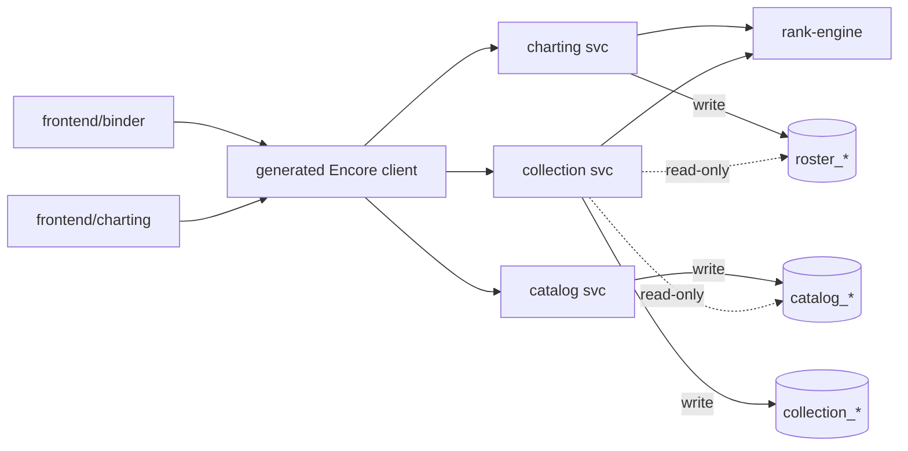
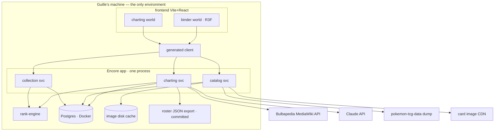
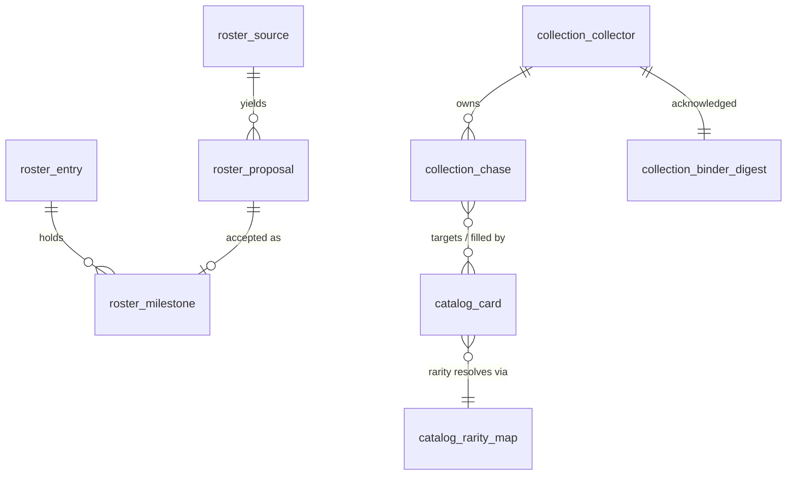

# Architecture Spine — tcgourney (Ash's Journey)

## Design Paradigm

**Functional core / imperative shell** (already live in the repo), extended systemwide:

- **Core** — `packages/rank-engine`: pure TypeScript, zero dependencies, no I/O. All derivation lives here.
- **Shells** — three Encore.ts **domain services** in one Encore app: `charting` (roster domain), `catalog` (cards + the Map), `collection` (chase state + binder composition). Each service is an imperative shell around the core and the sole writer of its own tables.
- **Third shell** — one Vite + React frontend with two route worlds: `binder/` (the cozy R3F world the UX spine governs) and `charting/` (the utilitarian review queue).

Dependency direction (this diagram is a rule):



`rank-engine` imports nothing. Services never import each other. `charting` never touches `catalog_*` or `collection_*` (card-agnostic). The frontend never talks to anything but the generated client.

## Invariants & Rules

### AD-1 — The functional core stays pure `[ADOPTED]`

- **Binds:** `packages/rank-engine`, all derivation logic
- **Prevents:** domain rules leaking into services and forking per consumer
- **Rule:** All Milestone → Stars → Rank → Slots → attribution derivation lives in `@tcgourney/rank-engine`: pure, zero-dependency, no I/O, no Encore/React imports. New derivation (rung attribution, badge computation) extends the package, never a service.

### AD-2 — Derived is never stored `[ADOPTED]`

- **Binds:** all (ADR-0003)
- **Prevents:** a second source of truth silently drifting from the engine
- **Rule:** The database persists authored facts only — Milestones, Verdicts, Citations, chase state, the Map. Stars, Rank, Slots, rung attribution, badges, and progress are recomputed on every read. No column ever caches them.

### AD-3 — Write authority is the seam

- **Binds:** all three services, all tables
- **Prevents:** two writers of one table; the App writing roster; Tool endpoints in the App's hot path
- **Rule:** One Encore app, one Postgres database, three services. Each service is the **sole writer** of tables carrying its prefix (`roster_`, `catalog_`, `collection_`). Cross-domain access is read-only SQL. The App reads roster tables directly, never through charting endpoints; `charting` never reads `catalog_*`/`collection_*` (PRD §1: card-agnostic). Mechanically: one `SQLDatabase` is declared in a shared module and imported by all three services — Encore isolates databases per service by default, so every crossing is explicit. FR-032's read-only App is structural, not policed.

### AD-4 — Slot address and fill cardinality

- **Binds:** collection domain, frontend
- **Prevents:** chase state storing derived data, or foreclosing N-for-1 equivalence (PRD §7)
- **Rule:** Chase state references a Slot by the natural key **(species, rung)**, rung = Stars 0–6, 0 = the ⚫ Catch slot. The species slug is minted **exactly once**, by the charting service on `roster_entry` (lowercase ASCII letters, digits, hyphens — `mr-mime`, `farfetchd`), is that table's **primary key** (one Entry per species — thirty Tauros are one Entry), and is copied verbatim by every other domain, never re-derived from a display name. The fill relation is **slot → N cards** (join table); the UI enforces 1 until equivalence rules exist (FR-029). Orphaned chase rows (a roster fix removed the slot) are surfaced through the errata flow, never auto-deleted.

### AD-5 — Rarity semantics live only in the Map

- **Binds:** catalog domain, every eligibility query
- **Prevents:** rarity strings hardcoded in code and diverging from the Map
- **Rule:** All rarity → Rank knowledge lives in the versioned, editable Rarity Translation Map table (FR-024, FR-028). No source-rarity string appears in TypeScript. Rarities absent from the Map are reported at ingestion and their Cards held out of eligibility (FR-026). Eligibility is a catalog-side SQL query over the **current** Map; Map versions are audit history, never a query target.

### AD-6 — Species resolution happens at ingestion

- **Binds:** catalog ingestion
- **Prevents:** "Charizard ex" name-parsing scattered across query sites
- **Rule:** Catalog rows carry National Dex number(s) resolved at ingestion from the source data, and `roster_entry` carries its species' dex number, authored during charting (species identity, not card knowledge — card-agnosticism intact). Eligibility joins Slots to Cards on dex number — never card-name parsing at query time.

### AD-7 — Card data is ingested, never fetched live

- **Binds:** catalog service, frontend
- **Prevents:** the binder held hostage by a CDN/API mid-migration (measured 40–58% failure rate)
- **Rule:** The catalog ingests the `pokemon-tcg-data` bulk JSON dump (FR-023). No live pokemontcg.io call exists in any request path. Card images: the frontend requests **only the catalog service**, which fetches from the CDN once on first view, caches to local disk, and serves from disk thereafter.

### AD-8 — The charting pipeline owns the LLM

- **Binds:** charting service
- **Prevents:** the pipeline living in chat history; API keys client-side; an undrafted queue breaking bulk-accept
- **Rule:** All Claude API calls live in the charting service; the key is an Encore secret, never client-side. Drafting is a **batch job per Milestone type** that pre-populates the review queue (FR-004/005/008). Every Source row stores its MediaWiki revision id + content hash; verdict stickiness (FR-014) is checked against the hash. The roster version stamp advances automatically on any accepted Verdict write (FR-018/020).

### AD-9 — Errata is computed App-side

- **Binds:** collection service
- **Prevents:** the Tool coupled to App needs; out-of-band roster edits invisible during mothball
- **Rule:** The collection service stores the last-acknowledged binder **snapshot** per Collector — per-entry (species → rank, slots, milestone types), never a scalar hash — and diffs it against the freshly computed binder at open to produce the errata slip ("N entries changed" + what moved). The roster version stamp is only the cheap change signal, never the diff source.

### AD-10 — Rung attribution is engine law

- **Binds:** rank-engine, frontend story row, badges
- **Prevents:** UI and badge logic inventing incompatible slot ↔ milestone mappings
- **Rule:** The k-th rung of an Entry is attributed to the k-th earned Milestone **type** in canonical ruleset order (opponent, teammate, encounter, bond, glory, loyal), computed in `rank-engine`. The story row shows **all** Milestone records of that type, flipping when there are several. A badge's Region is taken from the **earliest** record of the attributed type — earliest by canonical episode order (every Milestone records its episode, FR-006), insertion order breaking ties.

### AD-11 — One data path in the frontend

- **Binds:** both frontend route worlds
- **Prevents:** the two worlds fetching and caching differently
- **Rule:** All server data flows through the one generated Encore client, wrapped in TanStack Query as the single server-state layer. No hand-rolled `fetch`. The client is regenerated (`npm run gen:client`) after every endpoint change.

### AD-12 — GL owns the scene, DOM owns the words

- **Binds:** frontend binder world
- **Prevents:** per-surface rendering divergence (a WebGL cover that can't compose with DOM spreads)
- **Rule:** The binder scene — cover, pages, cards, light, page-turns, sleeving — is **one React Three Fiber canvas**. Interactive text inside card frames (explainers, citations, carousels) renders as DOM projected into the scene (drei `Html`), so links and selection stay real. Persistent HUD chrome (search bar, hover HUDs) is DOM overlay outside the canvas. Accessibility is a parallel DOM tree; `prefers-reduced-motion` replaces animations with cuts. No second scene technology, ever.

### AD-13 — Personal use only `[ADOPTED]`

- **Binds:** all (ADR-0004 — a legal constraint)
- **Prevents:** hosting/publishing work that silently reopens licensing
- **Rule:** No accounts, no auth, no multi-tenancy, no deployment target. Publishing is a licensing decision that precedes any hosting engineering, and is not scheduled.

### AD-14 — Ownership state is Collector-scoped

- **Binds:** collection domain (PRD §9)
- **Prevents:** the single-user assumption baked into the expensive-to-undo place
- **Rule:** Collection tables (chase state, fills, acknowledged digest) carry a `collector` reference even though exactly one Collector exists. Roster and catalog stay globally scoped.

## Consistency Conventions

| Concern | Convention |
| --- | --- |
| Naming (entities, files, interfaces) | The ubiquitous language of `CONTEXT.md` is authoritative in code and schema: Entry, Milestone, Proposal, Verdict, Source, Slot, Rank, Chasing/Filled, the Map. Tables `snake_case` with domain prefix (`roster_`, `catalog_`, `collection_`). Services lowercase singular. |
| Ids & keys | The **species slug** (lowercase kebab, e.g. `mr-mime`) is the only cross-domain natural key. Row ids are internal to their domain and never cross the seam. Card ids are the `pokemon-tcg-data` ids verbatim. |
| Data & formats | Timestamps `timestamptz` in Postgres, ISO 8601 UTC on the wire. Errors are Encore `APIError` codes — no custom envelopes. Wire types are mutable copies of engine output; the engine's `readonly`/`Set` types never leak into the API (existing pattern, ratified). |
| State & cross-cutting | Writes only through the owning service's endpoints. Migrations per service in Encore sequential `migrations/*.up.sql`. Secrets via Encore `secret()`. Frontend env via `import.meta.env`. |

## Stack

Verified current 2026-08-01 (web + repo research). Encore.ts + Postgres is deliberate despite the single-user mismatch — do **not** "fix" it to SQLite (ADR-0002).

| Name | Version |
| --- | --- |
| TypeScript | ^7.0.2 (existing) |
| Node.js | 24+ |
| Encore.ts | ^1.57.10 |
| Postgres | Encore-provisioned via Docker Desktop |
| Vitest | ^4.1.10 (existing) |
| React | ^19.2 |
| Vite | ^8.2 (Rolldown) |
| @react-three/fiber | ^9.6 |
| three | r185 (0.185.x) |
| @react-three/drei | ^10.7 |
| @tanstack/react-query | ^5.101 |
| @anthropic-ai/sdk | latest; model `claude-opus-5` |
| pokemon-tcg-data | GitHub bulk JSON (active; last update 2026-07-17) |

## Structural Seed

### System context



### Core entities



`roster_entry` is keyed by the species slug (AD-4) and carries the National Dex number (AD-6). `collection_chase` addresses a Slot by `(species, rung)` — no foreign key into roster tables, because Slots are derived (AD-2, AD-4). Manual Milestones (FR-016) are `roster_milestone` rows whose Citation is off-wiki and whose Proposal is Collector-authored. The roster version stamp is a single `roster_version` row advanced per AD-8.

### Deployment & environments

Local-only, forever (AD-13). Dev = `encore run` (API :4000, dashboard :9400) + Vite dev server (:5173); Docker Desktop is a hard prerequisite. CI = GitHub Actions running typecheck + all tests on push — the only remote automation. Backup = the committed roster JSON export (FR-019) plus the Docker-managed Postgres volume. There is no staging, no production, and no deploy pipeline by design.

### Source tree (target shape)

```text
tcgourney/
  packages/rank-engine/   # functional core — pure (AD-1)
  charting/               # Encore svc: sources, proposals, verdicts, LLM pipeline, export
  catalog/                # Encore svc: cards, the Map, ingestion, image cache
  collection/             # Encore svc: binder composition, chase state, errata
  frontend/
    src/binder/           # cozy R3F world (UX spine governs look & ritual)
    src/charting/         # utilitarian review queue
    src/client.ts         # the ONE generated Encore client
  roster-export/          # committed JSON artifact (FR-019)
  docs/adr/               # decision rationale
```

Migration note: today's `roster/binder.ts` (seed roster + `GET /binder`) dissolves into the `collection` service once Postgres lands; `SEED_LINES` dies with it.

## Capability → Architecture Map

| Capability / Area | Lives in | Governed by |
| --- | --- | --- |
| Source scoping + manifest (FR-001–003) | charting svc | AD-8 |
| Proposal generation + explainers (FR-004–007) | charting svc batch job | AD-8 |
| Verdict review queue, resumable, keyboard (FR-008–015) | charting svc + frontend/charting | AD-8, AD-11 |
| Manual Milestones, off-wiki citations (FR-016) | charting svc | AD-8 |
| Correction + version stamp (FR-017–018) | charting svc | AD-8 |
| Roster export command (FR-019–020) | charting svc endpoint + npm script | AD-3, AD-13 |
| Completion-gate reports (FR-021–022) | charting svc over rank-engine | AD-1, AD-2 |
| Catalog ingestion + the Map (FR-023–026, FR-028) | catalog svc | AD-5, AD-6, AD-7 |
| Unfillable-slot detection (FR-027) | collection svc (engine output × catalog eligibility) | AD-2, AD-5 |
| Binder + progress views (FR-030–031, FR-040) | collection svc + frontend/binder | AD-2, AD-9, AD-10, AD-12 |
| Entry view + story row (FR-033–035) | collection svc + frontend/binder | AD-10, AD-12 |
| Slot shortlist, Chasing, Filled (FR-036–039) | collection svc | AD-4, AD-14 |
| The Hunt (FR-041) | frontend/binder filter over collection svc | AD-11, AD-12 |
| Roster read-only in the App (FR-032) | structural — no write path exists | AD-3 |

## Deferred

- **Equivalence-rule mechanism** (FR-029, PRD Open Item 1) — the schema already allows N cards per slot (AD-4); design the rule when FR-027 reveals the actual unfillable set.
- **Rarity → tier assignments** (the Map's content) — Collector authoring work with its own ruleset, not architecture.
- **Bulk-accept type list** (Open Item 2, blocks FR-011) — settle before FR-011 enters a sprint.
- **Publishing, licensing, and card-imagery rights** (Open Items 3–4) — needed before any hosting work; none is scheduled (AD-13).
- **Charting Tool UX design** — deferred by the UX run to a later utilitarian pass; its routes and data discipline are already fixed (AD-3, AD-11).
- **Encounters-phase source workflow** — settled during the final charting phase, once Bulbapedia is exhausted.
- **Within-Region ordering** — ship Pokédex order; ordering is a swappable comparator (UX decision), no schema impact.
- **Badge artwork; further progress filters** (Open Item 7) — after the Binder is populated enough to know.
- **Batch drafting transport** (Anthropic Batches API vs sequential calls) — implementation detail inside AD-8.
- **Animation, foley, and ritual execution detail** — governed by the UX spine (DESIGN.md / EXPERIENCE.md), not this one.
